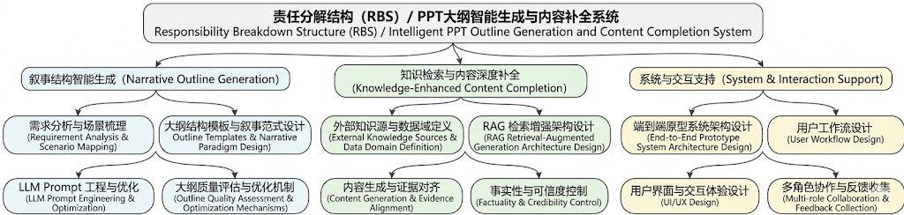
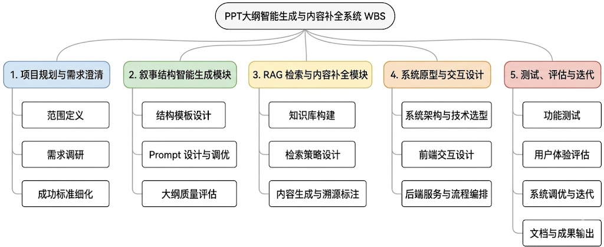
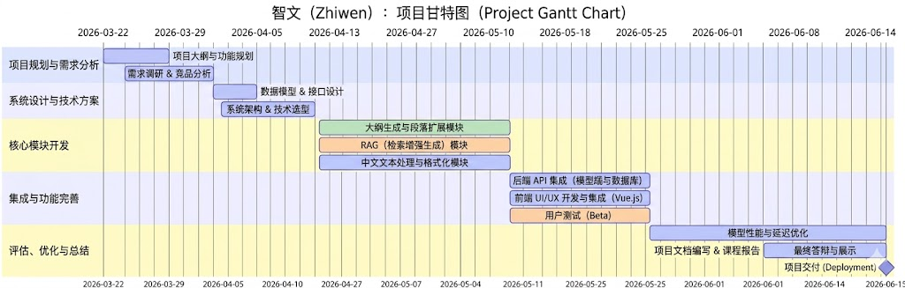
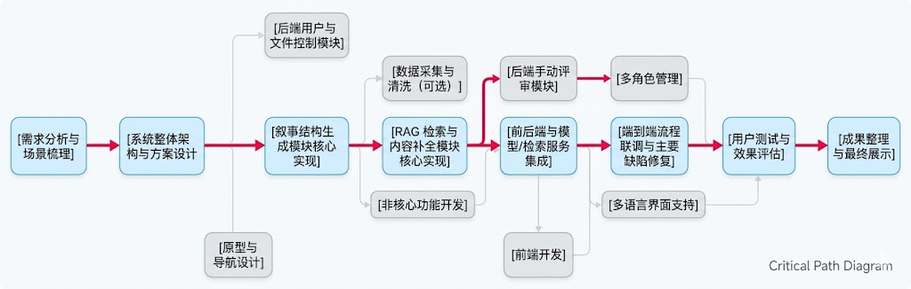

# RBS（责任分解结构）

责任分解结构（Responsibility Breakdown Structure, RBS）用于明确本项目中各模块、子任务及相关干系人的职责与边界，避免责任重叠或缺失，提升协同效率与项目可控性。本项目围绕“PPT 大纲智能生成与内容深度补全系统”的整体目标，从「叙事结构生成」、「知识检索与内容补全」、「系统与交互支持」三大维度进行责任分解。

## 1. 叙事结构智能生成（Narrative Outline Generation）

- **需求分析与场景梳理**：
	- 梳理商业汇报、学术展示、教育培训等典型 PPT 场景，对不同场景下的大纲结构需求进行归类与抽象。
	- 明确“从模糊主题/原始文档到结构化大纲”的关键痛点与质量要求。
- **大纲结构模板与叙事范式设计**：
	- 设计适用于多场景的 PPT 叙事结构模板（如总分总、问题-分析-方案、实验-方法-结果等）。
	- 定义页面粒度（章节、子章节、单页）的结构约束与元数据（标题、要点、过渡逻辑等）。
- **LLM 提示词工程（Prompt Engineering）**：
	- 设计面向“结构化大纲生成”的 Prompt 模板，约束模型输出的层次、分页方式和逻辑连贯性。
	- 针对不同输入形式（单一主题、文本摘要、完整文档）设计差异化 Prompt 策略。
- **大纲质量评估与优化机制**：
	- 制定大纲结构合理性、逻辑连贯性、完整性等评价指标与评分规则。
	- 设计基于规则与模型的自动/半自动大纲质量诊断与改写建议机制。

## 2. 知识检索与内容深度补全（Knowledge-Enhanced Content Completion）

- **外部知识源与数据域定义**：
	- 明确针对商业、教育、科研等不同领域所需的外部知识类型（论文、报告、公开数据等）。
	- 设计数据采集与预处理规范，确保知识源的可靠性与时效性。
- **RAG 检索增强架构设计**：
	- 设计支持向量检索/关键字检索混合的 RAG 流程（索引构建、召回、重排序、证据聚合）。
	- 定义每一页 PPT 内容与对应知识片段之间的关联方式与存证格式（出处、时间、链接等）。
- **内容生成与证据对齐**：
	- 利用 LLM 对检索到的知识进行压缩、重写与结构化整理，使之适配对应 PPT 页的叙事目标。
	- 设计“可溯源”的内容展示方式，在生成内容中显式或隐式标注证据来源，降低幻觉风险。
- **事实性与可信度控制**：
	- 制定“事实性错误率”“可溯源比例”等质量指标，并与 Success Criteria 对齐（如 80%+ 内容可溯源、事实性错误率 <5%）。
	- 设计人工抽查与自动一致性检查流程，持续改进检索与生成策略。

## 3. 系统与交互支持（System & Interaction Support）

- **端到端原型系统架构设计**：
	- 规划前端、后端、模型服务与检索服务之间的整体架构与接口协议。
	- 设计支撑高并发请求与多场景扩展的基础架构预案。
- **用户工作流设计**：
	- 设计“从输入到输出”的完整工作流：输入主题/上传文档 → 生成大纲 → 选择/调整 → 内容补全 → 导出 PPT。
	- 支持用户在不同环节进行人工干预（重生成、微调、锁定页面等）。
- **用户界面与交互体验**：
	- 设计友好的交互界面，支持大纲结构可视化、页面内容预览与快速编辑。
	- 关注不同类型用户（学生、教师、职场用户）的使用路径与学习成本。
- **多角色协作与反馈收集（如课程/实验场景）**：
	- 规划需求方（课程老师）、开发团队成员、试用用户之间的反馈与迭代机制。
	- 设计用户测试与问卷反馈模块，为“提升效率与质量”的目标提供数据支撑。

# WBS（工作分解结构）

工作分解结构（Work Breakdown Structure, WBS）将项目目标拆解为可管理、可度量的工作单元，便于任务分配、进度跟踪与风险控制。以下 WBS 以 RBS 的三大模块为基础，进一步细化到可执行的工作包（Work Packages）。

## 一、项目规划与需求澄清

- 项目立项与范围定义
	- 明确项目目标、边界与不做事项。
	- 识别主要干系人（课程老师、团队成员、潜在用户）。
- 需求调研与场景分析
	- 收集不同领域 PPT 使用场景与真实样例。
	- 访谈/问卷形式收集用户在“结构构建”“内容填充”方面的痛点。
- 成功标准与度量指标细化
	- 将 POS 中的 Success Criteria 量化为具体评估方案（如评分问卷设计、对照实验设计）。
	- 定义系统原型交付物与验收标准。

## 二、叙事结构智能生成模块

### 2.1 结构模板与规则设计

- 汇总典型 PPT 结构模式，形成结构模板库。
- 定义页面层级、章节关系与约束规则（最大层数、每层页数建议等）。
- 形成可配置的结构规范文档，便于后续实现与迭代。

### 2.2 Prompt 设计与调优

- 针对“单一主题输入”的大纲生成 Prompt 设计与测试。
- 针对“长文档输入”的摘要 + 大纲联合生成 Prompt 设计与测试。
- 建立 Prompt 版本管理与实验记录表，比较不同 Prompt 的结构质量。

### 2.3 大纲质量评估与自动改写

- 设计结构质量评价指标（逻辑连贯性、完整性、分页合理性等）。
- 实现基于规则/模型的自动评分脚本或流程。
- 设计自动/半自动大纲改写策略（如自动补充缺失章节、合并冗余页面）。

## 三、RAG 检索与内容补全模块

### 3.1 知识库构建

- 选择目标领域（商业、教育、科研）的代表性公开资料作为初始知识源。
- 实现文本清洗、分段、向量化等预处理流程。
- 构建向量索引与元数据索引（来源、时间、类型等）。

### 3.2 检索与召回策略设计

- 针对不同页面类型（问题提出、方法介绍、案例分析等）设计不同检索 Query 策略。
- 评估向量检索与关键词检索的互补性，设计混合检索方案。
- 制定召回结果质量评估指标（相关性、覆盖度、重复率）。

### 3.3 内容生成与溯源标注

- 实现基于 LLM 的知识浓缩、重组与页面内容生成逻辑。
- 设计内容与证据的映射与溯源展示格式（括号引用、尾注、悬浮提示等）。
- 通过小规模人工标注与评审，评估内容准确性与深度。

## 四、系统原型与交互设计

### 4.1 系统架构与技术选型

- 设计前后端及模型/检索服务的架构草图与接口定义。
- 根据资源与课程要求选择合适的 LLM 接入方式与检索框架（如开源向量库等）。

### 4.2 前端交互与页面设计

- 设计输入界面（主题/文档上传）、大纲展示界面、内容填充界面及导出界面原型。
- 支持用户对大纲结构与内容进行可视化编辑与局部重生。
生成一张项目工作分解结构（WBS）的层级结构示意图，参考给定的 Zhiwen Project Charter 中 WBS 图片的整体风格和配色：

### 4.3 后端服务与流程编排

- 实现大纲生成、RAG 检索、内容生成等核心 API。
- 设计任务队列与状态管理机制，保障请求过程可追踪。

## 五、测试、评估与迭代

### 5.1 功能与稳定性测试

- 针对关键流程（大纲生成、内容补全、导出）编写测试用例。
- 进行基本的性能与鲁棒性测试（多轮生成、异常输入等）。

### 5.2 用户体验与效果评估

- 组织小规模用户测试（同学或目标用户），收集主观评分与建议。
- 对照“未使用系统手工制作 PPT”的基线，评估效率与质量提升情况。

### 5.3 文档整理与成果输出

- 编写技术报告与使用说明书。
- 完成必要的代码整理、注释与开源准备工作。

# Gantt Chart（甘特图）

本项目将在学期内分阶段推进，涵盖规划、设计、实现、验证与总结等关键阶段。下述时间安排可根据授课进度与团队实际情况微调。

## 阶段 1：项目规划与需求分析（2026-03-22 ～ 2026-03-31）

- 完成项目立项文件与 POS（已完成）。
- 与课程老师沟通确认项目范围与评估指标。
- 完成典型 PPT 使用场景调研与需求归纳。

## 阶段 2：系统设计与技术方案（2026-03-31 ～ 2026-04-10）

- 完成整体系统架构设计（前端/后端/模型/检索）。
- 设计大纲结构模板库与 Prompt 策略草案。
- 制定知识库构建方案与数据来源清单。

## 阶段 3：核心模块开发（2026-04-10 ～ 2026-05-10）

- 叙事结构生成模块开发：实现基础大纲生成与结构约束逻辑。
- RAG 检索与内容补全模块开发：完成知识索引和内容生成主流程。
- 前端原型搭建：实现从输入到大纲展示的基础交互。

## 阶段 4：集成与功能完善（2026-05-10 ～ 2026-05-25）

- 集成大纲生成、检索与内容生成模块，实现端到端流程贯通。
- 完善界面交互，支持大纲与内容的局部编辑和重新生成。
- 初步进行功能与稳定性测试，修复主要缺陷。

## 阶段 5：评估、优化与总结（2026-05-25 ～ 2026-06-15）

- 开展用户测试，收集结构评分、内容准确性与效率提升等数据。
- 针对幻觉、结构不合理等问题进行针对性优化。
- 完成技术报告撰写与展示材料准备，整理并开源系统代码与文档。

# Critical Path Diagram（关键路径）

本项目的关键路径体现了从“需求澄清”到“系统原型交付与评估”的最短完工路径，有助于识别对整体工期影响最大的关键活动，指导资源优先投入与风险控制。关键路径可大致描述如下：

1. 需求分析与场景梳理 
2. 系统整体架构与方案设计 
3. 叙事结构生成模块核心实现 
4. RAG 检索与内容补全模块核心实现 
5. 前后端与模型/检索服务集成 
6. 端到端流程联调与主要缺陷修复 
7. 用户测试与效果评估 
8. 成果整理与最终展示

在该路径上，若任一关键活动发生较大延误，均可能导致整体项目延期，因此需要重点关注如下依赖关系：

- 若需求分析不充分，将直接影响架构设计与后续模块的合理性，增加返工风险。
- 叙事结构生成与 RAG 内容补全为两大核心能力，其开发与调优结果直接决定系统能否达到“结构评分 ≥4.5/5、事实性错误率 <5%”等目标。
- 前后端与模型/检索服务的集成是打通用户工作流的关键里程碑，决定是否能开展真实用户测试。
- 用户测试与效果评估不仅是结课交付要求，也是验证“效率与质量提升”的关键依据，必须保留充足时间进行迭代。

