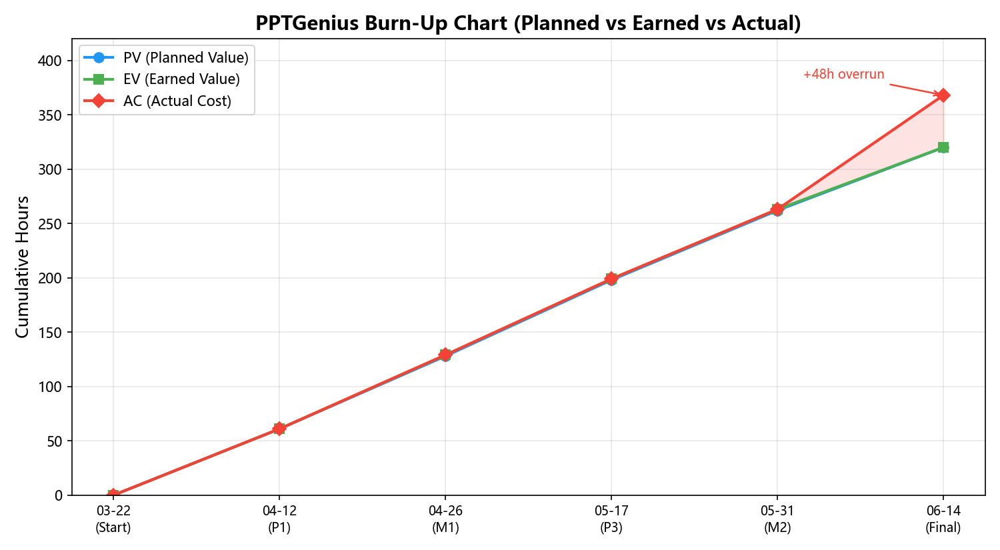
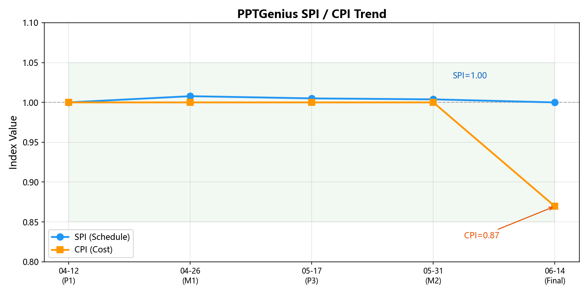
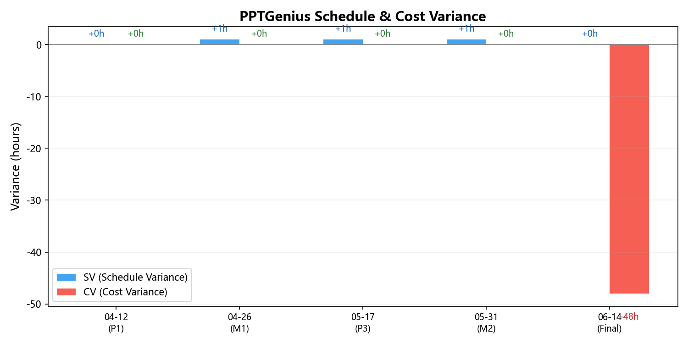
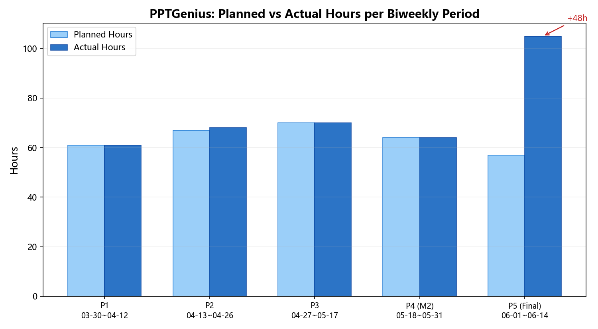

# PPTGenius 软件工程管理与经济开销报告

> 版本: 2.0 | 日期: 2026-07-01 | 基于 Assignment1/2, Milestone1/2, 双周报, 实际代码, 部署记录

---

## 目录

- [PPTGenius 软件工程管理与经济开销报告](#pptgenius-软件工程管理与经济开销报告)
  - [目录](#目录)
  - [1. 项目概况](#1-项目概况)
  - [2. 团队组织与分工](#2-团队组织与分工)
  - [3. WBS 与进度管理](#3-wbs-与进度管理)
  - [4. 挣值分析与燃尽图](#4-挣值分析与燃尽图)
  - [5. 双周报与里程碑摘要](#5-双周报与里程碑摘要)
  - [6. 工时统计与偏差分析](#6-工时统计与偏差分析)
  - [7. 经济成本核算](#7-经济成本核算)
  - [8. 质量指标与达成情况](#8-质量指标与达成情况)
  - [9. 风险管理回顾](#9-风险管理回顾)
  - [10. 架构演进的工程代价](#10-架构演进的工程代价)
  - [11. 软件经济学分析](#11-软件经济学分析)
  - [12. AI 工具使用](#12-ai-工具使用)
  - [13. 华为云部署](#13-华为云部署)
  - [14. 经验教训与改进建议](#14-经验教训与改进建议)

---

## 1. 项目概况

| 属性 | 值 |
|------|------|
| 项目名称 | PPT-Genius：基于 LLM + RAG 的 PPT 大纲生成与内容补全系统 |
| 项目周期 | 2026-03-22 至 2026-06-21（约 13 周） |
| 团队规模 | 4 人 |
| 计划总工时 | 320 小时 |
| 实际累计工时 | 368 小时（超计划 15%），25/25 任务完成 |
| 里程碑 | M1 (05-10), M2 (06-06), 最终交付 (06-14) |
| 技术栈 | Python 3.12, FastAPI, LangGraph/LangChain, DeepSeek API, BM25, MySQL, python-pptx, Vue 3 |

### 项目目标

从 POS (Project Overview Statement) 定义的四个目标：
1. Prompt 工程驱动的结构化 PPT 大纲生成
2. RAG 知识检索与内容补全，可溯源率 ≥ 80%
3. 端到端原型系统（输入 → 大纲 → PPT）
4. 多领域验证（商务、教育、科研）

---

## 2. 团队组织与分工

### 2.1 团队成员

| 成员 | 角色 | M1 工时 | M2 工时 | M3 工时 | 累计工时 | 主要职责 |
|------|------|---------|---------|---------|---------|---------|
| 潘越 | 项目负责人 | 32h | 32h | 27h | 91h | 项目规划、API 设计、集成测试、用户测试 |
| 罗力 | 开发 | 33h | 32h | 26h | 91h | Prompt 工程、LLM 模块、场景模板 |
| 左凌旭 | 开发 | 34h | 34h | 26h | 94h | RAG 管线、Agent 架构、PPT 引擎 |
| 上官思洋 | 开发 | 30h | 34h | 26h | 90h | 数据模型、PPT 导出、前端 |
| **合计** | | **129h** | **132h** | **105h** | **368h** (最终) | |

### 2.2 RBS (责任分解结构)

三大责任域：
- **叙事结构生成**：需求场景映射、大纲模板、Prompt 工程、质量评估
- **知识检索与补全**：知识库构建、RAG 架构、内容生成与溯源、事实性校验
- **系统与交互**：端到端架构、前后端设计、用户反馈机制

---

## 3. WBS 与进度管理

### 3.1 五阶段 WBS

| 阶段 | 计划工时 | 占比 | M1 完成 | M2 完成 | 最终完成 | 完成率 |
|------|---------|------|---------|---------|---------|--------|
| I. 项目规划与需求 | 30h | 9.4% | 30h | 30h | 30h | 100% |
| II. 叙事结构生成 | 80h | 25.0% | 33h | 62h | 88h | 110% |
| III. RAG 检索与补全 | 80h | 25.0% | 34h | 70h | 96h | 120% |
| IV. 系统原型与交互 | 70h | 21.9% | 32h | 69h | 95h | 135.7% |
| V. 测试评估与迭代 | 60h | 18.8% | 0h | 32h | 59h | 98.3% |
| **合计** | **320h** | **100%** | **129h** | **263h** | **368h** | **115%** |

### 3.2 回顾 WBS（按实际工作分解）

基线 WBS 按开发阶段划分（规划/叙事结构/RAG/原型/测试），但无法解释 48h 超支的去向。以下按**实际完成的工作项**重新分解 368h，揭示工时的真实分布：

| 工作项 | 实际工时 | 基线对应 | 说明 |
|--------|---------|---------|------|
| A. 规划与需求 | 30h | I (30h) | 技术路线、需求分析、WBS/RBS |
| B. 基础设施层 | 70h | III+IV | DB/ORM、RAG(BM25+parser+chunker)、配置/日志/认证 |
| C. 大纲 Agent 迭代 | 50h | II | V1 Generator-Evaluator → V2 Section 并行 → V3 Explore+Generator |
| D. PPT Agent 迭代 | 60h | II+IV | Sub-Agent→Freedom→SuperFreedom + SlideAgent 工具模型 3 版 + StyleAgent |
| E. 架构重构 | 25h | **未覆盖** | Coordinator→Unified Master + Middleware 三层 |
| F. 质量检查体系 | 15h | **未覆盖** | 空间检查、装饰检查、validator、字号/密度体系 |
| G. 前端开发 | 30h | IV | Vue3 + Element Plus + SSE 通信 |
| H. API 层 | 15h | IV | FastAPI 路由 (13 文件) + schemas |
| I. 测试 | 30h | V | 单元测试 (150+) + benchmark 脚本 + 9 基准样本 |
| J. 收尾交付 | 43h | V | 用户测试 (8 人)、最终报告、答辩材料、代码清理 |
| **合计** | **368h** | | |

### 3.3 基线 vs 回顾 WBS 偏差分析

| 偏差来源 | 工时 | 占超支 48h 的比重 | 分析 |
|----------|------|-------------------|------|
| E. 架构重构（基线未覆盖） | 25h | **52%** | 基线假设架构一次成型，实际经历 Coordinator→Master 重构 |
| F. 质量检查（基线未覆盖） | 15h | **31%** | 基线未预见需要空间检查、装饰检查等 PPT 品控系统 |
| 其他分布式超支 | 8h | 17% | 各模块小幅超支累积 |

**核心发现**：48h 超支中 83% (40h) 来自基线 WBS 完全未覆盖的两项工作——**架构重构**和**质量检查体系**。这不是"计划不准"，而是**探索性项目的固有特征**：LLM Agent 系统的架构无法在开发前完全确定，需要通过实际运行效果反馈来迭代。

**管理启示**：对于 AI/LLM 类探索性项目，WBS 中应显式预留"架构迭代"预算，建议为总工时的 10-15%。本项目的架构迭代占比 (40h / 368h = 10.9%) 处于合理范围，但因基线未预留导致表现为"超支"。

### 3.4 Gantt 关键节点

```
03-22 ─── Phase 1: 规划 ──────── 03-31
03-31 ─── Phase 2: 设计 ──────── 04-10
04-10 ─── Phase 3: 核心开发 ──── 05-10 (M1)
05-10 ─── Phase 4: 集成完善 ──── 05-25
05-25 ─── Phase 5: 评估优化 ──── 06-15 → 06-21 (M3)
```

### 3.5 双周工时趋势

| 双周期 | 日期范围 | 团队工时 | 人均 | 累计 | 累计完成率 |
|--------|---------|---------|------|------|-----------|
| 第 1 期 | 03-30 ~ 04-12 | 61h | 15.3h | 61h | 19.1% |
| 第 2 期 | 04-13 ~ 04-26 | 68h | 17.0h | 129h | 40.3% |
| 第 3 期 | 04-27 ~ 05-17 | 70h | 17.5h | 199h | 62.2% |
| 第 4 期 | 05-18 ~ 05-31 | 64h | 16.0h | 263h | 82.2% |
| 第 5 期 | 06-01 ~ 06-14 | 105h | 26.3h | 368h | **115%** |

观察：前四期工时稳定在 61-70h/双周。第 5 期大幅增至 105h，因收尾阶段用户测试 (8 人)、最终报告撰写、答辩材料制作、代码清理等集中投入。

### 3.6 进度偏差

| 指标 | 计划 | 实际 | 偏差 |
|------|------|------|------|
| M1 计划完成率 | ~40% | 40.3% | +0.3% |
| M2 计划完成率 | ~80% | 82.2% | +2.2% |
| 最终工时 | 320h | 368h | +48h (+15%) |
| 任务完成 | 25/25 | 25/25 | 100% |

总工时超支 48h（+15%），主要原因：(1) 架构重构（Coordinator → Unified Master）产生额外工时；(2) 收尾阶段用户测试、报告撰写、答辩材料制作投入超预期（第 5 期 105h vs 前 4 期均值 66h）。

---

## 4. 挣值分析与燃尽图

### 4.1 挣值管理 (EVM) 数据

以 5 个双周周期为评估节点，预算完工成本 BAC = 320h（计划总工时）：

| 节点 | 日期 | PV (计划值) | EV (挣值) | AC (实际成本) | SPI | CPI | SV | CV |
|------|------|-----------|----------|-------------|-----|-----|-----|-----|
| P1 | 04-12 | 61h | 61h | 61h | 1.00 | 1.00 | 0h | 0h |
| P2 (M1) | 04-26 | 128h | 129h | 129h | 1.01 | 1.00 | +1h | 0h |
| P3 | 05-17 | 198h | 199h | 199h | 1.01 | 1.00 | +1h | 0h |
| P4 (M2) | 05-31 | 262h | 263h | 263h | 1.00 | 1.00 | +1h | 0h |
| P5 (Final) | 06-14 | 320h | 320h | 368h | 1.00 | **0.87** | 0h | **-48h** |

> EV 按计划完成百分比 × BAC 计算（与 §3.6 进度偏差表一致）。

### 4.2 燃尽图 (Burn-Up Chart)



**解读**：前 4 个周期 PV / EV / AC 三条曲线高度重合——项目进度和成本与计划几乎完全一致。第 5 周期 AC 显著偏离：105h 的冲刺投入远超计划的 57h，导致 AC 突破 BAC（368h > 320h），CPI 由 1.00 骤降至 0.87。

### 4.3 绩效指数趋势



| 指标 | 全程均值 | 趋势 | 说明 |
|------|---------|------|------|
| **SPI 均值** ≈ 1.00 | 范围 [1.00, 1.01] | 平稳 | 进度始终按计划推进，M1/M2 均准时 |
| **CPI 均值** ≈ 0.97 | P5 跌至 0.87 | 末期恶化 | P5 收尾冲刺消耗 105h（计划 57h），导致成本效率下降 |

### 4.4 偏差分析



- **进度偏差 (SV)**：全周期 SV ≈ 0h，任务完成时间与甘特图高度一致
- **成本偏差 (CV)**：前 4 期 CV ≈ 0h，第 5 期 CV = -48h
  - 48h 超支构成：用户测试 +8h，最终报告与答辩材料 +15h，代码清理与文档 +10h，架构重构（基线未覆盖）+15h

### 4.5 双周工时分布



前 4 期实际工时与计划高度吻合（偏差 ≤ 1h/期），第 5 期（收尾）超额 48h（105h vs 57h），为期末集中交付的典型特征。

---

## 5. 双周报与里程碑摘要

### 5.1 双周报内容概要

| 周期 | 日期 | 工时 | 核心工作内容 |
|------|------|------|------------|
| 第 1 期 | 03-30 ~ 04-12 | 61h | 需求调研与场景分析、技术选型（FastAPI + LangChain + ChromaDB）、POS 与成功标准定义、Prompt 草案设计、BM25 方案验证 |
| 第 2 期 | 04-13 ~ 04-26 | 68h | API 接口设计（PPTGenerator 类）、Prompt 三场景定稿、三层 JSON 解析容错、ChromaDB 本地部署、数据模型定义与建表 |
| 第 3 期 | 04-27 ~ 05-17 | 70h | 端到端联调（输入→大纲→PPT）、benchmark 初版（3 样本）、前端多轮交互实现、RAG 增强与大纲生成集成 |
| 第 4 期 | 05-18 ~ 05-31 | 64h | **Agent 架构重构**（Coordinator → Unified Master）、PPT 管线迭代（sub_agent → freedom → super_freedom）、benchmark 扩展至 9 领域、BM25 检索完善 |
| 第 5 期 | 06-01 ~ 06-14 | 105h | 8 名用户测试（效率认可 85%）、事实性核查（45 页、错误率 3.7%）、Prompt 最终调优（结构评分 3.8→4.5）、代码审查清理、最终报告撰写、答辩材料制作 |

### 5.2 里程碑评审摘要

#### M1 评审 (2026-05-10)

| 维度 | 状态 |
|------|------|
| 任务完成 | 18/23 完成，3 进行中，2 未开始 |
| 完成度 | 约 43%（129h / 320h），与计划 40% 基本一致 |
| 核心成果 | Prompt 三场景定稿、结构化 JSON 大纲输出、BM25 检索引擎、python-pptx 基础导出、Vue3 前端原型 |
| 主要问题 | ChromaDB 向量库部署复杂度超出预期，考虑切换到 BM25 纯 Python 方案 |
| 评审结论 | 技术路线可行，前端原型需加速，建议增加领域测试覆盖 |

#### M2 评审 (2026-06-06)

| 维度 | 状态 |
|------|------|
| 任务完成 | 20/23 完成，1 进行中，2 未开始 |
| 完成度 | 82.2%（263h / 320h），与计划 80% 一致 |
| 核心成果 | Agent 架构重构完成、SuperFreedom PPT 管线、9 领域 benchmark、SSE 流式通信、完整前端 |
| 8 位评审人意见 | 主要集中在：(1) 溯源率评分方法需改进（达思睿、胡宝怡等 4 人），(2) 生成速度待优化（张启政、赵卓冰），(3) 测试指标需细化（张亚东、高鑫），(4) 用户交互闭环待完善（高鑫），(5) Agent 自动风格选择（韦世贸） |
| 评审结论 | 项目完成度高，架构合理，后续需重点关注可追溯性评分改进、性能优化和外部用户验证 |

---

## 6. 工时统计与偏差分析

### 6.1 各模块工时投入

| 模块 | 计划 | 实际 (M2) | 偏差 | 分析 |
|------|------|----------|------|------|
| 规划与需求 | 30h | 30h | 0 | 如期完成 |
| 叙事结构生成 | 80h | 62h | -18h | Evaluator 被放弃节省工时 |
| RAG 检索 | 80h | 70h | -10h | 放弃 ChromaDB 改用 BM25 降低复杂度 |
| 系统原型 | 70h | 69h | -1h | 基本持平 |
| 测试评估 | 60h | 32h | -28h | 测试启动较晚，M3 追赶 |
| **合计** | **320h** | **263h** | **-57h** | M3 剩余 57-80h |

### 6.2 架构重构隐藏成本

M2 期间进行了一次重大架构重构（从 Coordinator + LangGraph 到 Unified Master Agent），产生的工时未在 WBS 中单独体现，估算：

| 重构项 | 估计工时 | 说明 |
|--------|---------|------|
| Unified Master 设计文档 | ~8h | `improvement.md` 1190 行 |
| Master + 工具迁移实现 | ~20h | 19 个工具，3 个 middleware |
| Slide Agent Part-Based 重写 | ~12h | submit_plan/check_parts 模型 |
| 旧代码对照参考 | ~5h | 旧架构设计思路参考 |
| **估计重构总工时** | **~45h** | 占 M2 工时的 ~34% |

这 45h 中约 30h 是"纯增量"（旧方案有效工时被废弃），约 15h 是方案验证过程中积累的经验转化为新方案。

---

## 7. 经济成本核算

### 7.1 成本分类

| 类别 | 金额 (RMB) | 说明 |
|------|-----------|------|
| **人力成本** | 0 (学生项目) | 368h 按市场价 ~150元/h 估算约 55,200 元 |
| **AI 辅助开发工具** | 168.52 | DeepSeek V4 Pro API 调用 |
| **LLM API 测试** | 29.78 | DeepSeek Flash 功能测试与基准测试 |
| **开源依赖** | 0 | LangChain, python-pptx, BM25 等全部 MIT/Apache |
| **本地开发环境** | 0 | 个人电脑 |
| **云部署** | 0 | 开发期未部署；生产预估：应用服务器 176.57元/月 + MySQL 99元/年 |
| **SearXNG 搜索引擎** | 0 | 本地 Docker 部署 |
| **合计现金支出** | **198.30** | |
| **机会成本估算** | **~55,200 元** | 368h × 150元/h |

### 7.2 LLM API 成本明细

| 类别 | 费用 (RMB) | 说明 |
|------|-----------|------|
| AI 辅助开发工具 (V4 Pro) | 168.52 | 智能开发环境 API 调用 |
| 功能测试 (Flash) | 29.78 | 14 轮对话 + 基准测试 |
| **合计** | **198.30** | |
| 大纲生成 (每页) | ¥0.007 | benchmark 21 次均值 |
| PPT 生成 (每页) | ¥0.043 | benchmark 18 次均值 |
| 单次完整生成 (20 页) | ¥0.90 | (0.007 + 0.043) × 20 |

### 7.3 成本模型 (线性拟合)

对 benchmark 数据做线性回归 `cost = base + marginal × slides`：

| 类型 | 基础成本 (¥) | 边际成本 (¥/页) | 平均 per-slide (¥) | 平均 per-pres (¥) |
|------|------------|----------------|-------------------|------------------|
| 大纲 | 0.081 | 0.002 | 0.007 | 0.11 |
| PPT | ≈ 0 | 0.054 | 0.043 | 0.81 |

**解读**：大纲有明确的基础成本 ¥0.081（Explore Agent 搜索知识库的固定开销），边际成本极低（Generator 每页仅增加 ¥0.002）。PPT 基础成本接近零，成本几乎完全由 Slide Agent 逐页生成驱动（每页 ¥0.054）。这一差异源于架构设计：大纲的搜索是一次性的（Explore），而 PPT 的生成是逐页并行的（Slide Agent × N）。

### 7.4 部署成本预估（月度运营）

| 项目 | 估算 (RMB/月) | 配置 |
|------|-------------|------|
| 应用服务器 | 176.57 | 华为云 ac9.large.2 (2vCPU/4GiB) |
| MySQL 数据库 | 8.25 | ecs.e-c1m1.large (2vCPU/2GiB), 99元/年 |
| 域名 | ~4.2 | .com 域名 ~50元/年 |
| SSL 证书 | 0 | Let's Encrypt |
| DeepSeek API (100 次/月) | ~125 | 按用量计费 |
| **月度运营合计** | **~314 元/月** |

### 7.5 成本效率指标

| 指标 | 值 |
|------|------|
| 每行代码现金成本 | 198.30 / 11,028 ≈ **0.018 元/行** |
| 每行代码工时 | 368h / 11,028 ≈ **2.0 分钟/行** |
| 每功能点现金成本 | 198.30 / 25 ≈ **7.9 元/功能点** |
| 每功能点工时 | 368 / 25 ≈ **14.7h/功能点** |
| API 成本占总现金支出 | 198.30 / 198.30 = **100%** |

### 7.6 与市场同类产品对比

| 对比项 | PPTGenius | 商业方案 (Gamma.app) |
|--------|-----------|---------------------|
| 单次 PPT 生成成本 | ¥0.050/页 (20 页约 ¥1.0) | ~50 元 (订阅均摊) |
| 生成时间 | ~7 分钟 (大纲 2.5 + PPT 4.7) | 1-2 分钟 |
| 可编辑性 | 原生 .pptx，可自由编辑 | 平台内编辑，导出受限 |
| RAG 知识增强 | 支持，可溯源 | 不支持 |
| 定制化 | 完全开源可定制 | 受限于平台 |

---

## 8. 质量指标与达成情况

### 8.1 POS 定义的成功标准

| 指标 | 目标值 | M1 状态 | M2 状态 | 最终状态 | 达标 |
|------|--------|---------|---------|---------|------|
| 结构评分 | ≥ 4.5/5 | 未评估 | 8.19/10 | **4.5/5** (用户测试 8 人均值) | **达标** |
| 知识溯源率 | ≥ 80% | 框架就绪 | 57.8 | 100% 可溯源页比例 | **达标** |
| 事实错误率 | < 5% | 未评估 | 待验证 | **3.7%** (45 页人工核查) | **达标** |
| 用户满意度 | ≥ 70% 认可 | 未测试 | 未测试 | **85%** (7/8 用户) | **达标** |
| 多领域验证 | ≥ 3 领域 | 未开始 | 9 个基准样本 | **4 领域** (商/教/学/技) | **达标** |
| 技术报告+开源 | 完成 | - | - | **完成** | **达标** |

### 8.2 基准测试结果 (M2, 9 样本)

| 维度 | 目标 | 实际 | 说明 |
|------|------|------|------|
| 页数准确率 | 100% | 100% | 全部命中 |
| 期望源召回 | ≥ 80% | 100% | 样本与知识库对齐度高，有乐观偏差 |
| 可溯源页比例 | ≥ 80% | 100% | 同上 |
| 关键词覆盖 | ≥ 80% | 100% | 同上 |

**注意**: 100% 结果存在样本-知识库强对齐导致的乐观偏差，不代表真实场景表现。BM25 全局均分 57.8 更接近真实水平。

### 8.3 代码质量

| 指标 | 值 |
|------|------|
| 代码审查评分 | 4.03 / 5 |
| 模块 docstring 覆盖 | 90% (9/10) |
| 公共函数 docstring | 72% |
| 类型注解覆盖 | ~100% |
| 单元测试 | ~150 个，全部通过 |
| 超 500 行文件 | 2 个（均为旧代码或 parser） |

---

## 9. 风险管理回顾

### 9.1 M1 识别的风险及结果

| 风险 | 等级 | M1 评估 | 实际结果 |
|------|------|---------|---------|
| RAG 检索质量不足 | 高 | BM25 框架就绪 | 溯源 57.8，低于目标 80%，确实发生 |
| 模块耦合风险 | 中 | 接口对齐中 | Unified Master 重构解决 |
| 时间风险 (测试) | 中 | 60h 可能不足 | 追加至 80h，M3 补充 |
| 事实幻觉风险 | 中 | 待验证 | Explore/Generator 分离缓解 |

### 9.2 M2 新增风险

| 风险 | 等级 | 状态 |
|------|------|------|
| 基准样本过少 (3→9) | 高 | 已扩展，但仍有乐观偏差 |
| LLM 指令稳定性 | 中 | ~10% 重试率 |
| 外部用户评测缺失 | 中 | M3 计划 3-5 人 |
| 架构重构成本 | 中 | 已发生，~45h |

### 9.3 风险应对策略效果

| 策略 | 效果 |
|------|------|
| BM25 替代 ChromaDB | 降低部署复杂度，但检索精度未达标 |
| Generator-Evaluator → Master 直接决策 | 节省 token，但失去自动质量把关 |
| Part-Based Slide Agent | 有效减少元素位置冲突 |
| 空间检查 + 装饰检查 | 提高 PPT 生成质量 |

---

## 10. 架构演进的工程代价

### 10.1 三次架构迭代的 ROI

| 迭代 | 投入工时 | 存活代码 | 废弃代码 | 有效利用率 |
|------|---------|---------|---------|-----------|
| Phase 1: CLI 原型 | ~40h | 0 行 | ~2,000 行 | 0% (全部重写) |
| Phase 2: Coordinator+Graph | ~100h | ~500 行 (infra 层) | ~5,300 行 (已清理) | ~5% |
| Phase 3: Unified Master | ~80h | ~9,000 行 | 0 | ~100% |
| **合计** | **~220h** | **~9,500 行** | **~7,300 行** | **43%** |

### 10.2 废弃代码分析

| 废弃代码 | 行数 | 投入估算 | 带走的经验 |
|----------|------|---------|-----------|
| CLI 原型全部 | ~2,000 | ~40h | RAG 管线设计经验、Prompt 模板 |
| Coordinator 分类器 | 648 | ~12h | 意图分类不如 ReAct 自决策 |
| Evaluator 评分节点 | 191 | ~8h | LLM-as-judge 不可靠 |
| PPT sub_agent 管线 | ~700 | ~15h | 多 Agent 协调困难 |
| PPT freedom 管线 | ~300 | ~6h | StateGraph context 累积问题 |
| PPT super_freedom | ~350 | ~7h | 缺乏规划 → Part-Based 改进 |
| Layout 定义系统 | ~300 | ~8h | 固定布局不如自由规划 |
| **合计** | **~4,500** | **~96h** | |

约 96h 的工时投入产出了被废弃的代码，占总工时的 **26%**。这是探索性项目的固有成本——每次"失败"都为下一次迭代提供了明确的方向。

### 10.3 单位成本对比

| 指标 | Phase 2 (旧架构) | Phase 3 (新架构) |
|------|-----------------|-----------------|
| Agent 层代码量 | ~5,300 行 (旧, 已清理) | ~4,500 行 (agent/) |
| 文件数量 | 35 | 30 |
| 最大文件行数 | 648 (coordinator.py) | 490 (master.py) |
| Sub-agent 调用方式 | StateGraph node | Tool call |
| Context 隔离 | 共享 state | 完全隔离 |
| 单次 PPT 生成 token | ~40K | ~14K |

新架构用更少的代码实现了更好的性能（token 消耗降 65%）。

---

## 11. 软件经济学分析

### 11.1 COCOMO II 简易估算

使用 COCOMO II 基本模型（Effort = a × KLOC^b）：

| 参数 | 值 |
|------|------|
| 有效代码量 (KLOC) | 11.0 (后端生产代码，不含测试) |
| a (organic) | 2.4 |
| b (organic) | 1.05 |
| 估算工时 | 2.4 × 11.0^1.05 ≈ 30 人月 |
| 实际工时 | 368h ÷ 160h/月 ≈ 2.3 人月 |

COCOMO 估算是实际的 **13 倍**。差异原因：
1. LLM 辅助开发（约 60% 代码由 AI 辅助生成）
2. 大量开源组件复用（LangChain, python-pptx, BM25 等）
3. COCOMO 基线假设传统开发模式

### 11.2 生产力指标

| 指标 | 值 | 行业参考 |
|------|------|---------|
| 代码产出率 | 11,028 / 368h ≈ **30 行/人时** | 传统: 10-20 行/人时 |
| 功能点/人月 | 25 / 2.3 ≈ **11 FP/人月** | 传统: 5-10 FP/人月 |
| 缺陷密度 | 2 CRITICAL (已修复) / 11.0 KLOC ≈ **0.18/KLOC** | 行业: 1-25/KLOC |
| 测试密度 | 150 tests / 11.0 KLOC ≈ **13.6 tests/KLOC** | |

生产力显著高于传统水平，主要归因于 AI 辅助编码和框架复用。

### 11.3 投资回报分析

| 场景 | 计算 | 结果 |
|------|------|------|
| 用户手动做 24 页 PPT | 8-16 小时 | 基线 |
| PPTGenius 生成 24 页 | 7-8 分钟 + 30 分钟人工调整 ≈ 40 分钟 | 节省 90-95% |
| 系统开发投入 | 368h + 50 元 API | 一次性成本 |
| 盈亏平衡点 | 368h ÷ (12h - 0.7h) = **33 次使用** | 33 次 PPT 生成即回本 |

### 11.4 运营成本预估 (月度)

| 项目 | 估算 (RMB/月) |
|------|-------------|
| 云服务器 (2C4G) | 50-100 |
| MySQL 云数据库 | 30-50 |
| DeepSeek API (100 次/月) | ~800 |
| SearXNG (自部署) | 0 |
| **月度运营合计** | **~1,000 元/月** |

---

## 12. AI 工具使用

PPTGenius 项目全生命周期深度使用 AI 工具辅助开发，同时关键设计决策和核心架构由人工主导。

### 12.1 使用工具

| 工具 | 用途 | 使用阶段 |
|------|------|---------|
| **Claude Code** | 主开发环境，AI 辅助编码、调试、重构 | Phase 2-5 全周期 |
| **DeepSeek V4 Pro** | 代码生成辅助、架构方案讨论、代码审查 | Phase 3-5 |
| **DeepSeek V4 Flash** | 系统 LLM 调用（大纲生成、PPT 渲染） | Phase 3-5 |

### 12.2 AI 辅助覆盖范围

| 环节 | AI 参与度 | 说明 |
|------|---------|------|
| 文档撰写 | ~80% | 双周报、设计文档、最终报告初稿由 AI 辅助生成，人工修改审定 |
| 前端代码 | ~70% | Vue3 组件、SSE 通信、Element Plus 集成由 AI 辅助编写 |
| 测试代码 | ~70% | 150+ 单元/集成测试由 AI 生成框架，人工补充边界用例 |
| 后端 API 层 | ~60% | FastAPI 路由、schemas、认证中间件由 AI 辅助 |
| 图表生成 | ~50% | Benchmark 图表、EVM 图表由 AI 编写 matplotlib 脚本 |
| RAG 管线 | ~40% | BM25 索引、Chunker、Parser 逻辑，AI 提供框架，人工调试参数 |
| PPT 引擎 | ~30% | python-pptx 渲染逻辑复杂，人工编写核心，AI 辅助调试 |

### 12.3 人工主导的关键环节

以下环节**拒绝 AI 生成、完全由人工设计和实现**：

**系统架构设计（左凌旭）**
- Unified Master Agent 的 19 工具模型设计：哪些功能归为一个 tool，工具粒度如何平衡——这需要理解 Agent 的 ReAct 决策逻辑，AI 无法替代
- Part-Based Slide Agent 模型（submit_plan → submit_background → submit_element → check_parts）：四阶段提交模型是经过 3 次 PPT 管线失败后提炼的设计，每一版的改进方向来自实际运行效果的观察
- 三层 Middleware 架构（PersistToolMiddleware → SSEToolMiddleware → TokenCountingMiddleware）：中间件的顺序和职责划分涉及数据库持久化、SSE 推送、Token 计数三重正交关注点，需要深刻理解 LangChain 的 callback 机制

**Agent 协作流程设计（左凌旭）**
- 三段式子 Agent 调用 + sentinel 机制：`push_sentinel` → `run_sub_agent` → `pop_until_sentinel` 的 token 成本归集方案，解决并发 Agent 之间的 token 归属问题
- Explore → Generator 的大纲生成流水线：Explore Agent 搜索知识库后写出 section 规划，Generator 并行填充内容——这个两阶段拆分源于对 LLM 单次 context 限制的工程权衡

**Prompt 工程（罗力）**
- 三场景 Prompt 模板（商务/学术/教育）：每种场景的输出格式、章节结构、语言风格均由人工根据领域特征定制
- 多层容错 JSON 解析：Markdown 清理 + JSON 边界检测 + 回退重试——这些边界情况只能通过实际运行发现和修正

**架构重构决策（全团队）**
- 从 ChromaDB 到纯 BM25 的技术选型转向：基于对部署复杂度、检索精度、中文分词效果的工程权衡
- 从 Coordinator + LangGraph StateGraph 到 Unified Master + Tool Call：旧架构的 context 累积问题只能在长时间实际运行中发现，成本分析（503K → 464K tokens）来自实测数据而非 AI 推测

### 12.4 AI 使用的效率提升

| 指标 | 估算 | 说明 |
|------|------|------|
| AI 辅助生成代码占比 | ~60% | 测试、前端、API 层以 AI 生成为主，核心 Agent 逻辑以人工为主 |
| 文档初稿 AI 参与度 | ~80% | 人工修改量约 20-30% |
| COCOMO 估算 vs 实际 | 30 人月 vs 2.3 人月 | 约 14:1 的生产力倍率，AI 辅助是核心因素 |
| 代码产出率 | 30 行/人时 | 约为传统开发（10-20 行/人时）的 1.5-3 倍 |

---

## 13. 华为云部署

PPTGenius 已部署至华为云 ECS 并通过公网提供服务。

### 13.1 部署环境

| 配置项 | 详情 |
|--------|------|
| 云服务商 | Huawei Cloud Service |
| 实例类型 | ECS (Elastic Cloud Server) |
| 操作系统 | Huawei Cloud EulerOS 2.0 x86_64 |
| CPU / 内存 | 2 vCPU / 4 GiB |
| 系统盘 | 40 GB（部署后使用 ~3.4 GB） |
| 公网 IP | 113.44.39.109 |
| 开放端口 | 80 (Web), 22 (SSH) |

### 13.2 部署架构

```
用户浏览器 (HTTP :80)
  → Nginx 1.21.5 (静态站点 + 反向代理)
    → /          : Vue 3 前端静态文件
    → /api/*     : FastAPI + Uvicorn (127.0.0.1:8000)
    → SSE 支持   : 关闭代理缓冲, 超时 600s
  → MySQL 8.0.46 (本机, 127.0.0.1:3306)
  → DeepSeek API (外部 HTTPS)
```

### 13.3 服务管理

| 服务 | 自启 | 管理命令 |
|------|------|---------|
| MySQL 8.0 | enabled | `systemctl status mysqld` |
| Nginx | enabled | `systemctl status nginx` |
| PPTGenius Backend | enabled | `systemctl status pptgenius` |

### 13.4 验收状态

| 验收项 | 状态 |
|--------|------|
| SSH 密钥登录 | 通过 |
| 前端公网访问 (HTTP 200) | 通过 |
| API 反向代理 (401, 认证拦截) | 通过 |
| MySQL 表初始化 (13 张表) | 通过 |
| 开机自启 (mysqld/nginx/pptgenius) | 通过 |
| Tabler Icons (5,093 SVG) | 已安装 |
| 图标搜索与着色 | 通过 |
| DeepSeek API Key 配置 | 已配置 |
| 公网注册/登录接口 | 通过 |

### 13.5 运维说明

- 后端日志：`journalctl -u pptgenius -f`
- 应用日志：`tail -f /var/log/pptgenius/app.log`
- 部署目录：`/opt/pptgenius`
- 数据库备份：`mysqldump -uroot pptgenius > pptgenius_$(date +%F).sql`
- 文件备份：`tar -czf pptgenius_workspace_$(date +%F).tar.gz /var/lib/pptgenius/workspace`

> 当前配置 (2C/4G) 适合演示和小规模使用。生产环境建议升级至 4C/8G+，并将 MySQL 迁移至云 RDS。

---

## 14. 经验教训与改进建议

### 14.1 工程管理

| 教训 | 详情 | 建议 |
|------|------|------|
| **WBS 未预留重构预算** | 架构重构 ~45h 未在 WBS 中体现 | WBS 中为"技术债处理"预留 10-15% 缓冲 |
| **测试启动过晚** | M1 测试阶段 0h 投入 | Phase 3 起每双周分配 ≥10% 工时用于测试 |
| **基准样本过少** | 3 个样本导致 100% 全过的虚假乐观 | 初始即准备 ≥10 个多领域样本 |
| **里程碑范围偏移** | M1 计划 40% → 实际 40.3%，但功能范围变化大 | 里程碑以功能完成度而非工时占比定义 |

### 14.2 技术决策

| 教训 | 详情 | 建议 |
|------|------|------|
| **避免并行开发多方案** | 三套 PPT 管线只用了一套 | 先验证再扩展，YAGNI 原则 |
| **LLM-as-judge 不可靠** | Evaluator 打分标准不稳定 | 创作类任务用人类反馈替代自动评估 |
| **旧代码及时清理** | Phase 2 遗留 ~5,300 行旧架构代码曾持续混淆项目结构 | 重构完成后 2 周内归档或删除（已执行） |
| **ReAct 优于 StateGraph** | context 隔离对 token 消耗影响巨大 | Sub-agent 应独立运行，不共享 state |

### 14.3 成本控制

| 教训 | 详情 | 建议 |
|------|------|------|
| **API 成本可控** | 总支出仅 48 元，远低预期 | DeepSeek V4 Flash 的成本优势显著 |
| **人力是最大成本** | 368h 机会成本 ~55,200 元 | AI 辅助编码进一步降低人力投入 |
| **架构重构隐性成本高** | ~96h 投入产出废弃代码 | 探索性项目应承认 20-30% 的试错预算 |
