# PPTGenius 用户手册

> 在线访问：<http://113.44.39.109/>

---

## 目录

- [PPTGenius 用户手册](#pptgenius-用户手册)
  - [目录](#目录)
  - [1. 系统概述](#1-系统概述)
  - [2. 快速开始](#2-快速开始)
  - [3. 界面概览](#3-界面概览)
  - [4. 注册与登录](#4-注册与登录)
  - [5. 创建对话](#5-创建对话)
  - [6. 生成 PPT 大纲](#6-生成-ppt-大纲)
  - [7. 上传知识文件](#7-上传知识文件)
  - [8. 生成 PPT 内容](#8-生成-ppt-内容)
  - [9. 查看与管理](#9-查看与管理)
  - [10. 修改 PPT 内容](#10-修改-ppt-内容)
  - [11. 导出 PPT](#11-导出-ppt)
  - [12. 知识库管理](#12-知识库管理)
  - [13. 费用查看](#13-费用查看)
  - [14. 常见问题](#14-常见问题)

---

## 1. 系统概述

PPTGenius 是一个基于 AI 的 PPT 智能生成平台。您只需输入一个主题或上传参考文档，系统会自动完成以下流程：

```
输入主题/文档 → 大纲规划 → 知识检索 → 内容填充 → PPT 渲染 → 导出 .pptx
```

**核心功能**：

| 功能 | 说明 |
|------|------|
| AI 智能生成 | 输入主题，自动生成结构化大纲和可视化 PPT |
| 知识增强 | 上传文档后，PPT 内容可溯源至原文 |
| 多轮对话修改 | 用自然语言修改任意页面 |
| 原生格式导出 | 生成可编辑的 .pptx 文件 |

> **重要**：PPT 生成分为两个阶段——系统先生成文字大纲，您确认后再指示 Agent 继续生成 PPT 页面。详见 [§2 快速开始](#2-快速开始)。

---

## 2. 快速开始

以下四步带您完成从登录到导出的全流程。

### 第一步：登录系统

打开浏览器访问 <http://113.44.39.109/>，输入账号密码登录。如无账号，点击「注册」先创建账号。

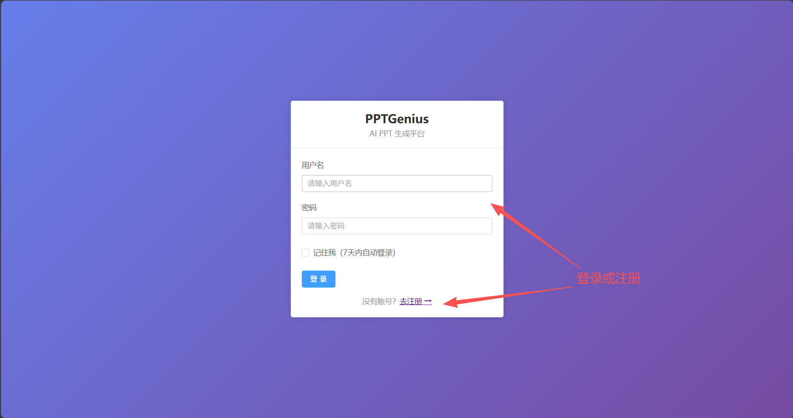

### 第二步：输入主题，生成大纲

登录后进入主界面，点击左侧「＋ 新建对话」创建对话，在底部聊天框输入 PPT 主题（如「帮我做一个关于新能源汽车的 PPT」），按 Enter 发送。

系统将自动搜索相关知识、规划章节结构并生成大纲。**此时生成的是文字大纲，还不是 PPT。**

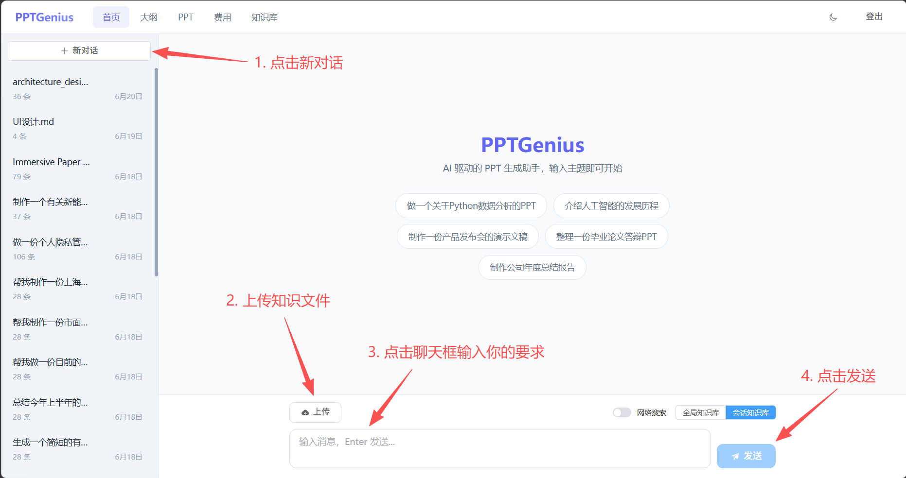

### 第三步：确认大纲，继续生成 PPT

大纲生成后，点击「Document Card」预览大纲内容。确认无误后，**在对话框中输入「开始生成 PPT」或类似指令**，Agent 将逐页渲染 PPT 内容。

> **关键操作**：大纲生成后，Agent 不会自动继续生成 PPT。您需要主动发送指令（如"开始生成 PPT"），Agent 才会进入 PPT 生成阶段。

生成完成后可点击「PPT Document Card」预览效果。

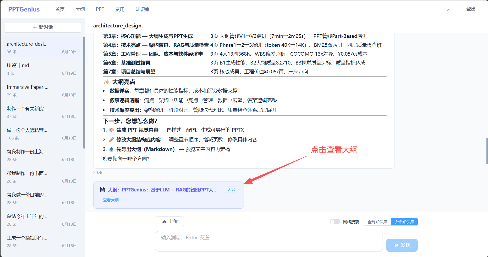

### 第四步：导出下载

在 PPT 预览页或详情页点击「导出」按钮，系统生成 .pptx 文件并自动下载。导出的文件可在 PowerPoint / WPS 中打开编辑。

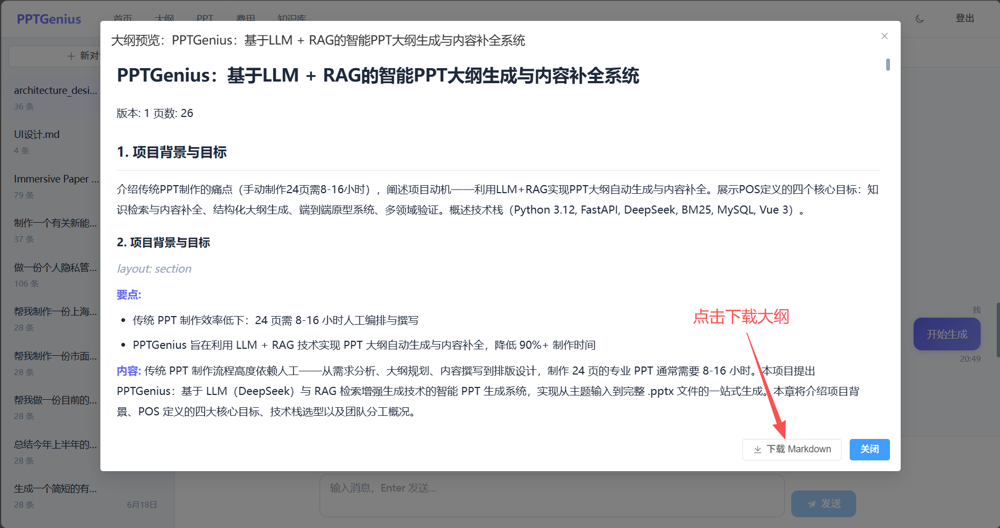

### 第五步：修改或生成PPT

在检查大纲后，你可以继续发出修改该指令或者生成PPT，PPT的预览与导出则与Outline的相似。

---

## 3. 界面概览

登录后进入的主界面包含以下功能区域：

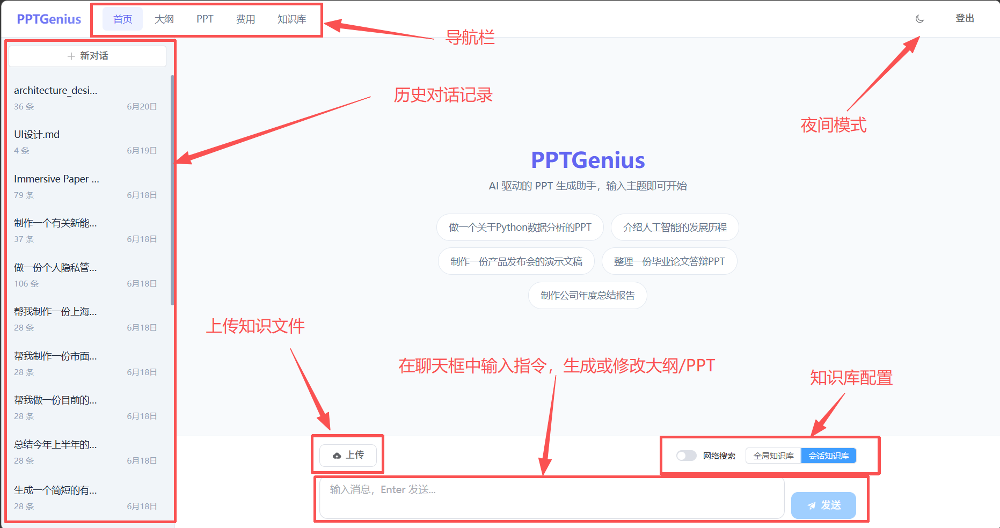

| 区域 | 位置 | 功能说明 |
|------|------|---------|
| **导航栏** | 页面顶部 | 系统 Logo、对话/演示文稿/知识库/消费 等导航入口，用户菜单与退出登录 |
| **历史对话栏** | 左侧边栏 | 显示所有对话列表，支持新建对话（「＋」按钮）、切换对话、归档对话 |
| **聊天框** | 中央主区域 | 与 Agent 交互的核心区域：输入主题/指令、查看生成进度（工具调用卡片）、查看生成结果（Document Card） |
| **上传知识文件** | 聊天框下方工具栏 | 点击附件按钮或拖拽文件，上传 PDF/DOCX/XLSX/TXT/MD 等参考文档 |
| **知识库配置** | 网络搜索开关和知识库切换 | 可以选择打开和关闭网络搜索功能，可以在全局知识库和对话知识库中切换 |
| **夜间模式** | 导航栏或用户菜单 | 切换深色/浅色主题，保护夜间使用体验 |

---

## 4. 注册与登录

### 4.1 注册账号

1. 在登录页面点击「注册」
2. 输入用户名和密码（密码长度 ≥ 6 位）
3. 点击「注册」，成功后自动跳转至登录状态

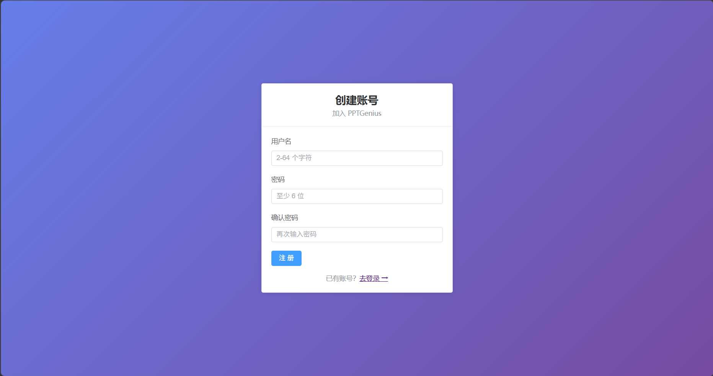

### 4.2 登录

1. 输入已注册的用户名和密码
2. 点击「登录」
3. 登录成功后进入主界面

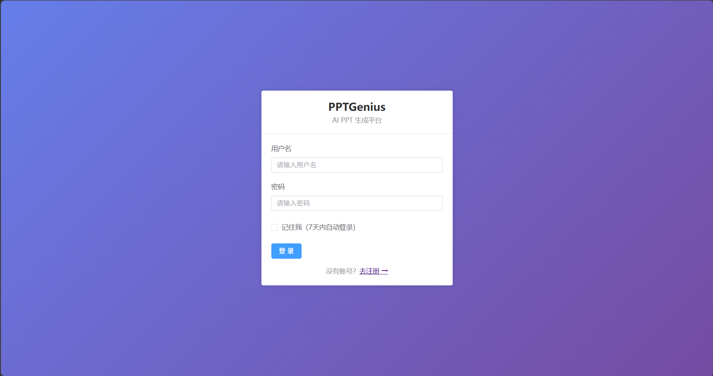

> **提示**：登录状态默认保持 7 天。如需退出，点击右上角用户菜单 →「退出登录」。

---

## 5. 创建对话

PPTGenius 以"对话"为单位管理每个 PPT 生成任务。每个对话可以包含多轮交互。

### 5.1 新建对话

1. 点击左侧历史对话栏顶部的「＋ 新建对话」
2. 在弹出的对话框中输入对话标题（如"新能源汽车 PPT"）
3. 点击确认

### 5.2 切换与归档对话

- **切换对话**：点击历史对话栏中的对话标题即可切换
- **归档对话**：鼠标悬停在对话上，点击出现的「归档」按钮
- 归档后的对话不在列表中显示，但数据保留在服务器

---

## 6. 生成 PPT 大纲

### 6.1 从主题生成大纲

1. 进入对话后，在底部聊天框输入 PPT 主题
2. 例如：「帮我制作一份关于人工智能发展历史的 PPT，包含关键技术突破和未来展望」
3. 按 Enter 发送

系统将自动执行：探索知识库与网络信息 → 规划章节结构 → 为每个章节生成详细内容。

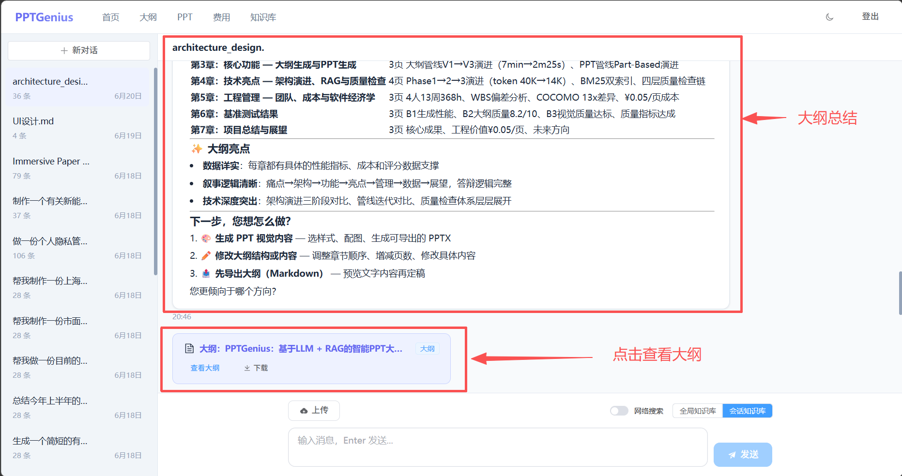

生成过程中可点击工具调用卡片查看 Agent 的执行步骤（explore 搜索、gen_content 生成等）。

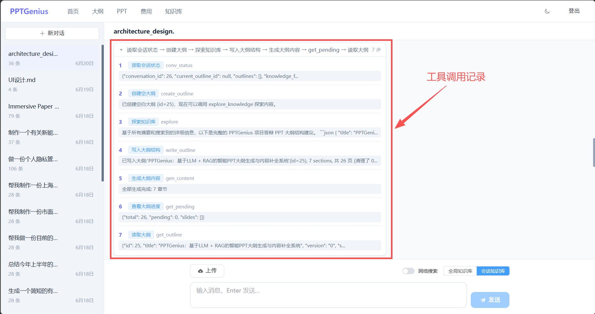

### 6.2 从文档生成大纲

1. 先上传参考文档（见 [§7 上传知识文件](#7-上传知识文件)）
2. 输入指令，例如：「根据我上传的 PDF，生成一份讲解 PPT」
3. 系统会自动读取文档内容，生成更有深度的 PPT

> **注意**：如果已上传文档但不想使用，可以在对话中说明「不需要参考文件」。

### 6.3 查看大纲

大纲生成完成后，会在对话中显示一张 Document Card。点击卡片可查看：
- 各章节标题和描述
- 每页幻灯片的标题、要点和详细内容
- 引用来源标注

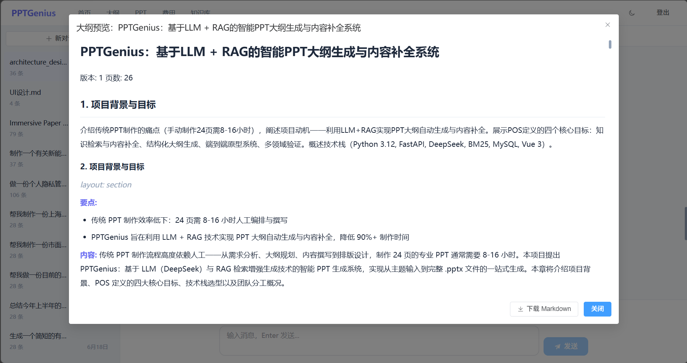

---

## 7. 上传知识文件

PPTGenius 支持上传参考文档，让 PPT 内容有据可查。

### 7.1 支持的文件格式

| 格式 | 扩展名 | 说明 |
|------|--------|------|
| PDF | .pdf | 学术论文、报告 |
| Word | .docx | 文档 |
| Excel | .xlsx, .csv | 数据表格（自动转为统计摘要） |
| 文本 | .txt, .md | 纯文本 |

### 7.2 上传方式

**方式一：点击按钮上传**

点击聊天框下方工具栏的「📎 附件」按钮，选择本地文件。

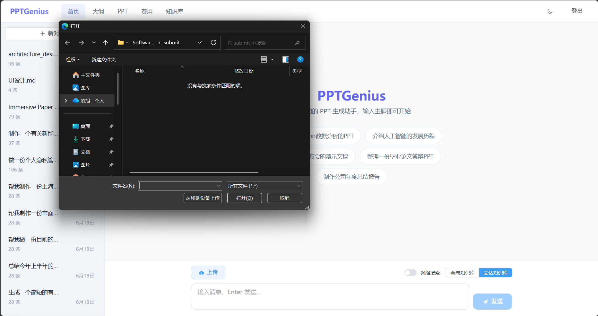

**方式二：拖拽上传**

将文件直接拖拽到对话区域即可上传。

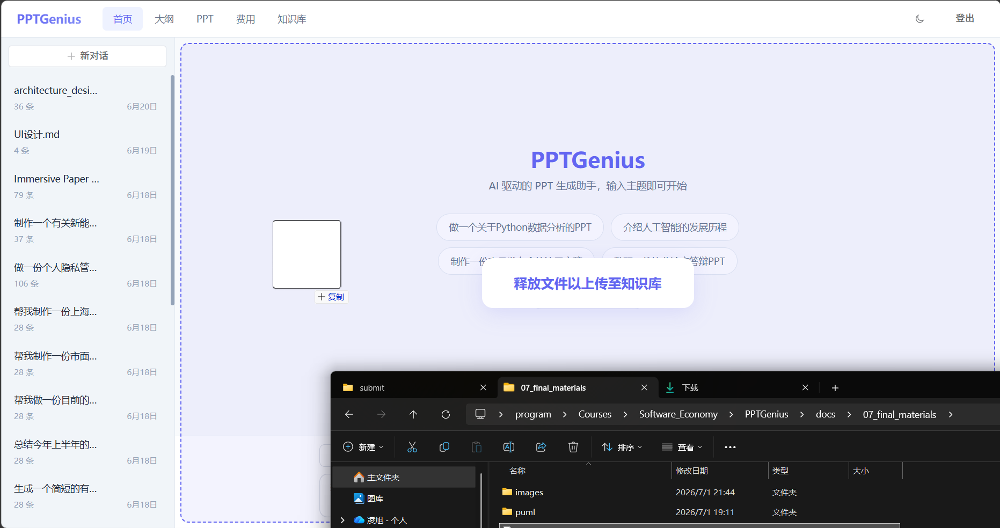

文件上传后会自动解析并建立检索索引，并且根据文件的头部和尾部进行总结。

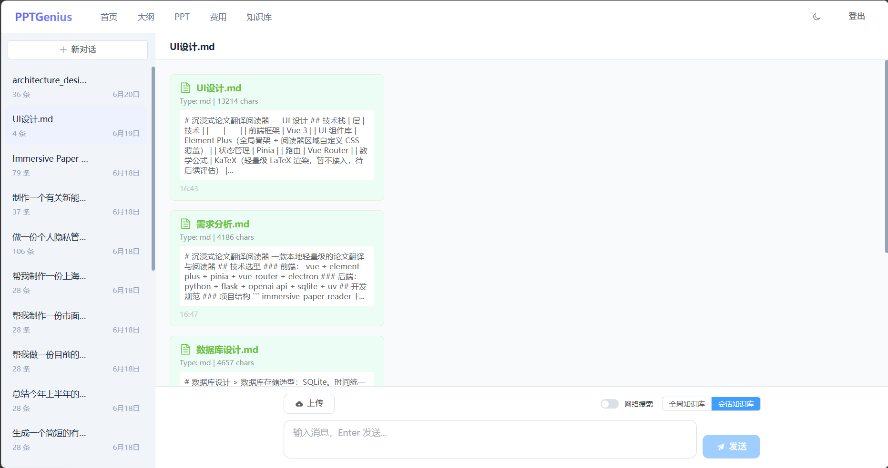

---

## 8. 生成 PPT 内容

大纲确认后，您可以指示 Agent 生成可视化的 PPT 页面。

### 8.1 生成 PPT

1. 大纲生成并确认无误后，在聊天框输入「开始生成 PPT」或类似指令
2. 系统自动：选择配色和字体方案 → 逐页设计版面（文本、图表、表格、装饰元素）→ 渲染为 .pptx

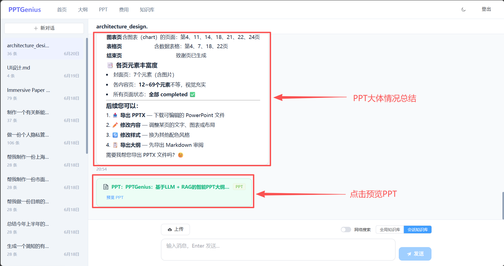

> 生成过程约 4–7 分钟，取决于内容复杂度。过程中可点击工具调用卡片查看每页的生成进度。

### 8.2 查看 PPT 预览

PPT 生成完成后会显示 PPT Document Card。点击卡片进入预览页面：
- 左侧：幻灯片缩略图列表
- 中央：当前页的效果预览

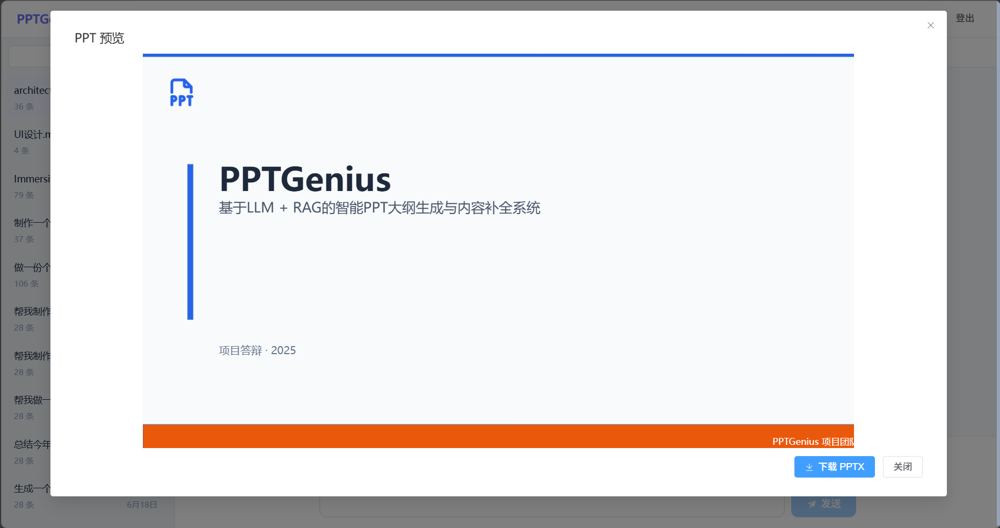

---

## 9. 查看与管理

### 9.1 PPT 列表

点击导航栏「演示文稿」，查看所有已生成的 PPT。

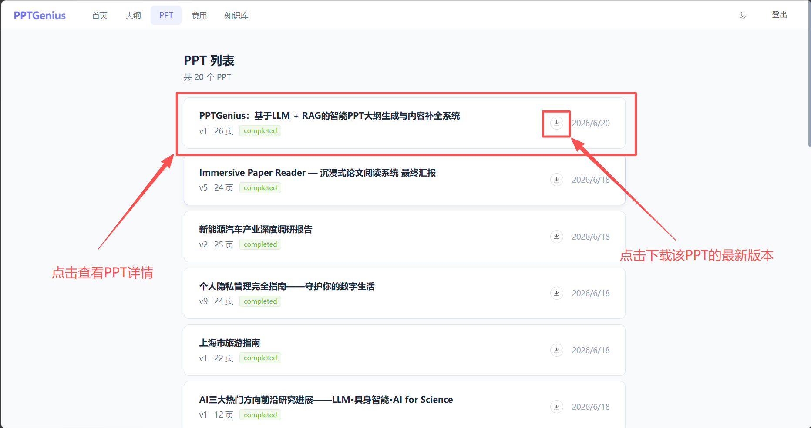

### 9.2 PPT 详情

点击任意 PPT 进入详情页，可查看版本号、大纲版本号、幻灯片数量、样式名称等信息，以及所有历史快照版本。

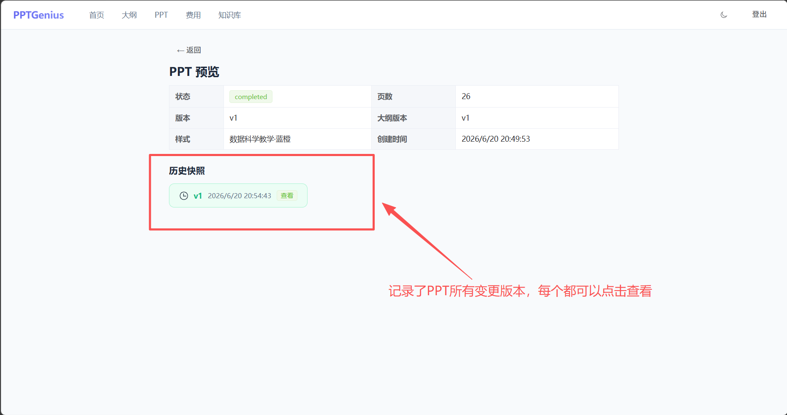

### 9.3 大纲列表与历史

大纲支持版本管理，每次修改自动创建快照。

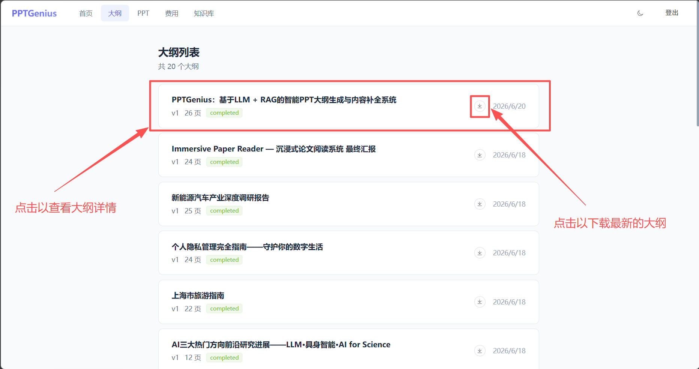

点击任意大纲查看详情，包括各章节结构和版本信息，以及所有历史快照版本。

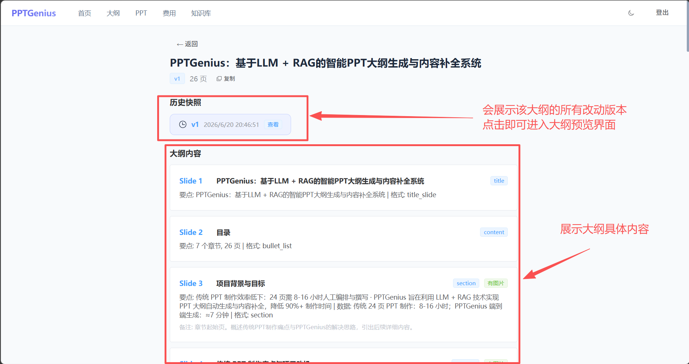

---

## 10. 修改 PPT 内容

PPTGenius 支持通过自然语言指令修改 PPT。

### 10.1 修改单页内容

在对话中输入修改指令，例如：

- 「把第 5 页的标题改成'新能源汽车市场趋势'」
- 「第 8 页的饼图换成柱状图」
- 「在第 3 页和第 4 页之间插入一页讲技术路线」

系统会自动识别需要修改的页面并重新生成。

### 10.2 修改整体风格

- 「全部背景改成深色」
- 「把所有图表颜色调亮一些」
- 「整份 PPT 用更精简的风格」

### 10.3 修改大纲结构

- 「在第 2 章后面加一节讲行业案例」
- 「把第 3 章和第 4 章合并」

系统会自动更新大纲、同步 PPT 结构并重新生成受影响的页面。

---

## 11. 导出 PPT

### 11.1 导出 .pptx 文件

在 PPT 详情页，点击「下载 PPTX」按钮下载 .pptx 格式的ppt文件

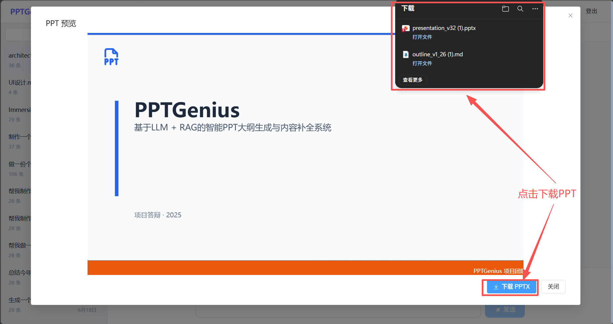

导出的 .pptx 可在 PowerPoint / WPS / LibreOffice 中打开和编辑。

### 11.2 导出大纲 Markdown

在大纲详情页，点击「下载 Markdown」下载 .md 格式的大纲文本。

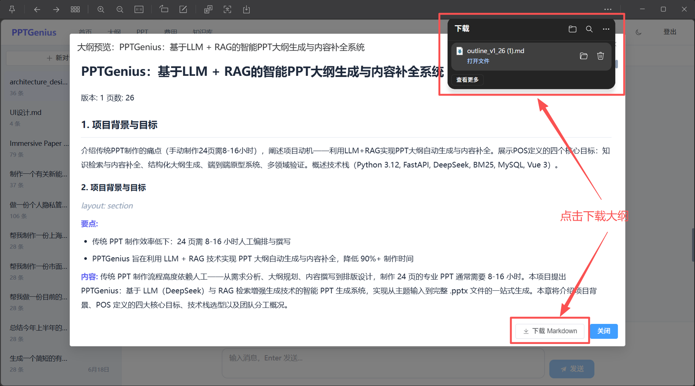

---

## 12. 知识库管理

### 12.1 知识库范围

PPTGenius 为每个用户维护独立的知识库，所有上传文件存储在自己的账号下。

### 12.2 查看文件列表

点击导航栏「知识库」，查看已上传文件（含文件名、类型、大小、上传时间）。

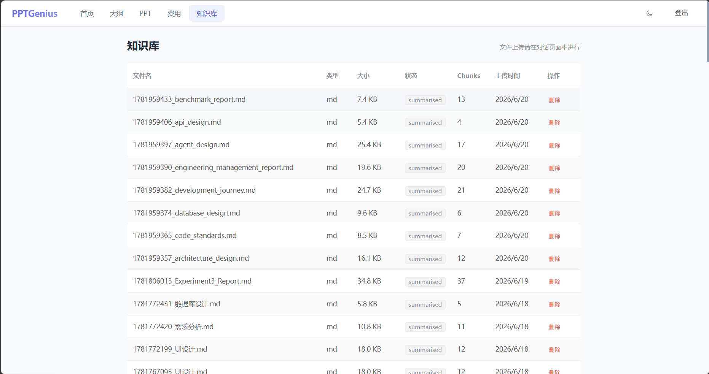

### 12.3 删除文件

1. 在文件列表中，点击目标文件的「删除」按钮
2. 确认删除后，文件及关联的检索索引将被清除

---

## 13. 费用查看

### 13.1 查看消费记录

点击导航栏「费用」，查看 Token 消耗统计和各次调用的费用明细。

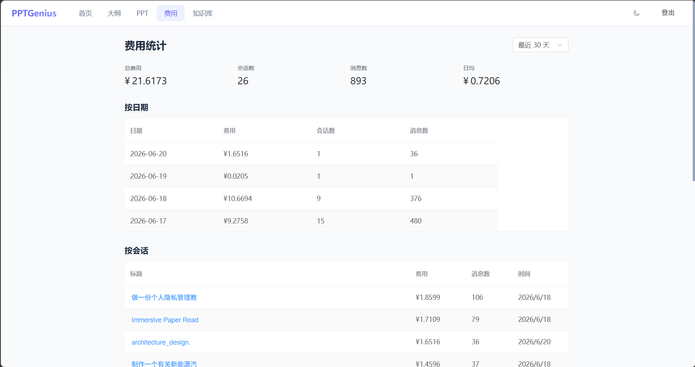

### 14.2 费用构成

| 费用类型 | 大致范围 | 说明 |
|---------|---------|------|
| 大纲生成 | ¥0.11/次 | 含知识搜索和内容生成 |
| PPT 生成 | ¥0.81/次 | 含样式选择和逐页渲染 |
| 单页成本 | ¥0.05/页 | 大纲 + PPT 合计 |

> 数据来源：Benchmark 实测，DeepSeek V4 Flash。

---

## 14. 常见问题

### Q1: 生成速度慢怎么办？

PPT 生成时间取决于页数（通常 4–7 分钟）。如需加速：
- 减少 PPT 页数
- 关闭网络搜索功能（仅使用知识库）
- 选择"精简"风格模式

### Q2: 大纲生成不完整？

- 如果部分章节内容为空，输入「请完成第 X 章的剩余内容」
- 也可以输入「重新生成第 X 章」

### Q3: PPT 中的图表数据不准确？

- 上传包含数据的 Excel/CSV 文件
- 在 prompt 中明确说明数据来源
- 使用修改功能纠正具体数据

### Q4: 如何提高内容质量？

- 上传高质量的参考文档
- 在 prompt 中提供具体的领域背景
- 使用专业版样式（elaborate 模式）
- 基准测试显示事实错误率 < 5%

### Q5: 支持哪些语言？

- 目前主要支持简体中文
- 也支持 English、繁體中文
- 可在 prompt 中指定输出语言

### Q6: 数据安全吗？

- 所有对话和文件存储在自己的账号下
- 知识库按用户隔离
- 不上传数据至第三方（LLM API 调用除外）

### Q7: 忘记密码怎么办？

请联系管理员重置密码。目前系统未集成邮箱/短信找回功能。


