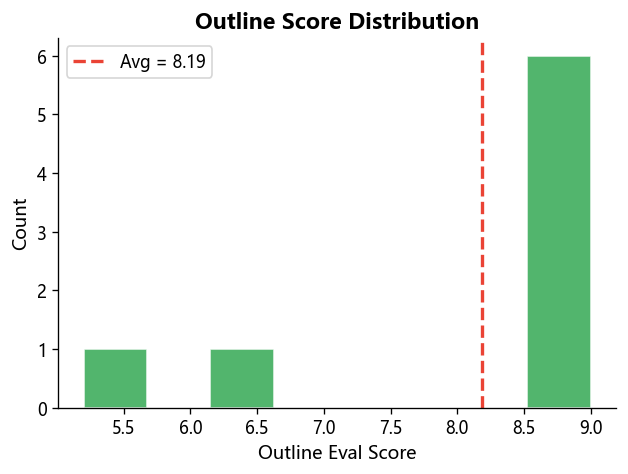
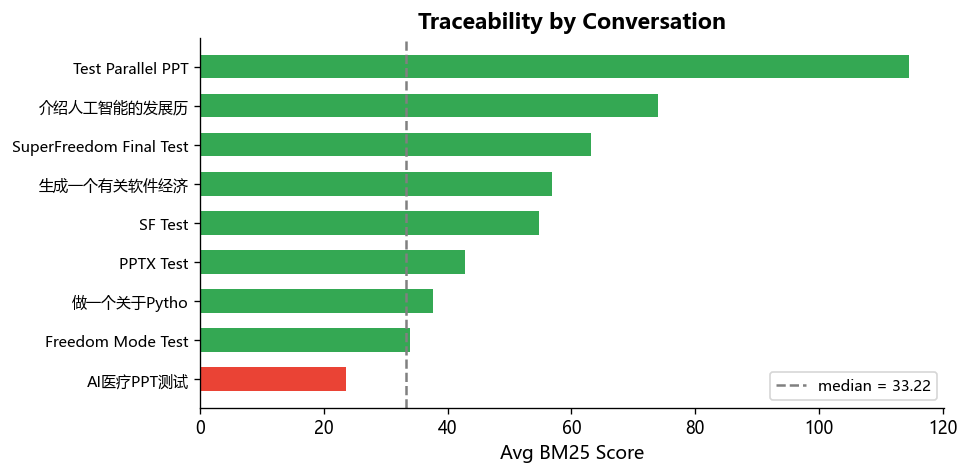

# PPTGenius Benchmark Report

**Generated**: 2026-06-05 11:00:37 | **14 conversations**

## Summary

| Metric | Value |
|--------|-------|
| Conversations | 14 (Outline: 1, PPT: 8 / 5 other) |
| Total Messages | 90 |
| Total Token Cost | $6.7905 |
| Cost / Outline Conv | $0.1324 |
| Cost / PPT Conv | $1.1170 |
| Avg Outline Score | 8.19 (sd=1.37, range=[5.20, 9.00]) |
| Avg BM25 Score (per-sentence) | 50.776 |

## Outline Score Distribution

## Traceability by Conversation

## Per-Conversation Detail

| Title | Type | Msgs | Cost | Outlines | Avg Score | Slides | Trace Avg |
|-------|------|------|------|----------|-----------|--------|-----------|
| 生成一个有关软件经济 | PPT | 14 | $3.4208 | 1 | 5.20 | 24 | 56.933 |
| 介绍人工智能的发展历 | PPT | 6 | $0.8532 | 1 | 9.00 | 20 | 73.965 |
| Freedom Mode Test | PPT | 6 | $0.7537 | 1 | 9.00 | 12 | 33.936 |
| PPTX Test | PPT | 6 | $0.6513 | 1 | 9.00 | 6 | 42.825 |
| Test Parallel PPT | PPT | 8 | $0.3450 | 1 | 9.00 | 11 | 114.504 |
| SuperFreedom Final Test | PPT | 7 | $0.3194 | 1 | 6.60 | 4 | 63.096 |
| AI医疗PPT测试 | PPT | 11 | $0.1651 | 1 | 8.88 | 22 | 23.595 |
| SF Test | PPT | 6 | $0.1302 | 1 | — | 3 | 54.748 |
| 做一个关于Pytho | Outline | 3 | $0.1146 | 1 | 8.80 | 17 | 37.598 |
| 做一个关于Pytho | Other | 2 | $0.0274 | 0 | — | 0 | — |
| 2026_SEME_Introducti | Other | 18 | $0.0057 | 0 | — | 0 | — |
| 介绍人工智能的发展历 | Other | 2 | $0.0043 | 0 | — | 0 | — |
| Parallel PPT Test | Other | 0 | $0.0000 | 0 | — | 0 | — |
| 介绍人工智能的发展历 | Other | 1 | $0.0000 | 0 | — | 0 | — |

## 计算方式说明

### 对话分类

对话类型优先由消息记录中的 document 消息决定，无 document 消息时回退到数据库表：

1. 按 `idx` 顺序遍历对话的所有消息
2. 找到第一条 `role='document'` 且 `content_type='outline'` 的消息 → Outline 类型
3. 找到第一条 `role='document'` 且 `content_type='ppt'` 的消息 → PPT 类型
4. 若无 document 消息，检查 `outlines` 表和 `presentations` 表作为回退
5. 优先级：PPT > Outline > Other
6. 仅取第一条对应类型的 document 消息，**后续修改不纳入统计**

### 费用计算

- 仅统计 `role='assistant'` 的 AI 消息的 `estimated_cost`
- 有 document 消息时：累加第一条 document **之前** 的所有 AI 消息费用 **+** document **之后第一条** assistant 消息费用（生成后的总结回复）
- 无 document 消息时：累加所有 AI 消息费用
- 修改请求的费用不计入（它们在第一条 document 之后）

### 可追溯性 (Traceability) 计算

1. 对每个大纲 slide 的文本内容（标题 + 笔记 + 正文）按句子切分
2. 每句（长度 ≥ 3）对用户的个人知识库执行 BM25 检索（top-5）
3. 取返回结果中的最高 BM25 score 作为该句的追溯分数
4. **`trace_score_avg`**：所有句子的 BM25 score 的**全局平均值**
   - 该指标与句子总数无关，不受对话数量不均衡的影响，是衡量整体可追溯性的**首要指标**
5. **`trace_ratio`**：BM25 score ≥ 中位数阈值（当前 = 33.22）的句子占比
   - 阈值取所有句子的 BM25 score 中位数，自动适应数据分布。BM25 分数受索引大小、文档长度、查询特征等因素影响，不同数据集上分数分布差异较大，固定阈值无意义

### 大纲评分

- 每条大纲在生成时由 Evaluator Agent 打分（0-10），存储于 `outlines.eval_score`
- 同一对话可能有多条大纲（多次生成），取均值作为该对话的 Avg Score

---
*PPTGenius Benchmark · Auto-generated*
